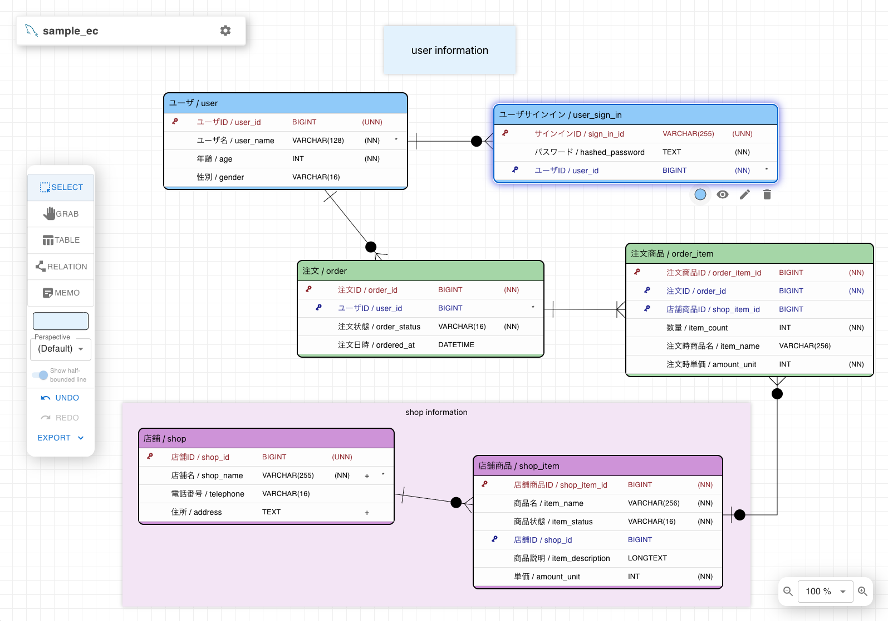
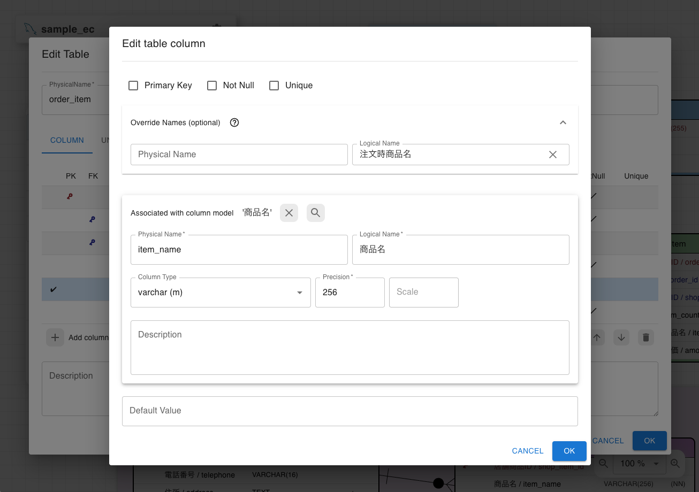
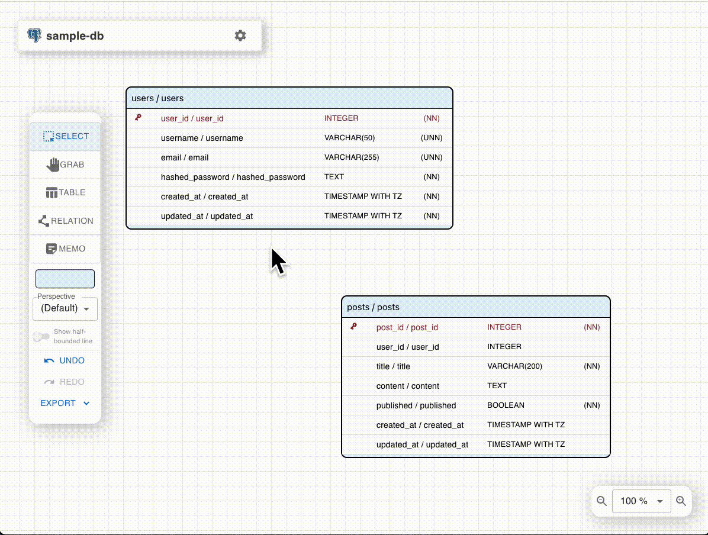
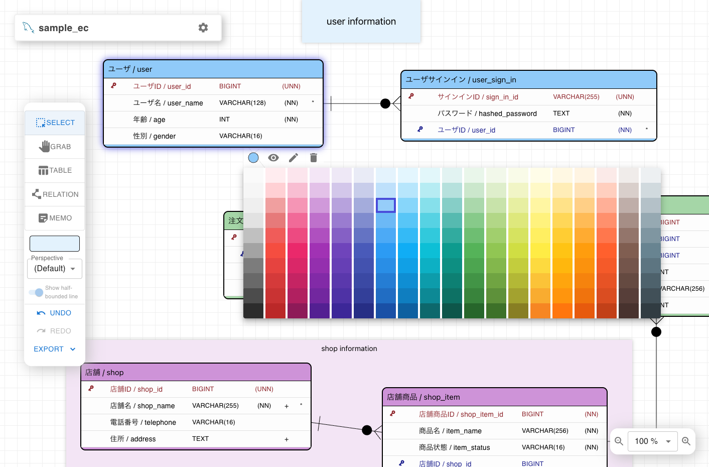
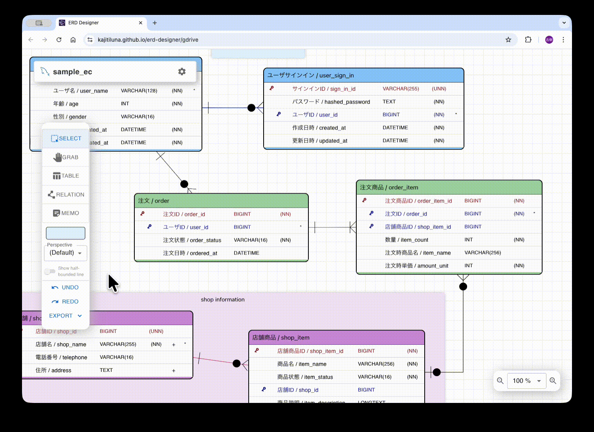

# Entity Relationship Diagram Designer

**ERD Designer** is a free, open-source tool for visually designing database schemas.
Design your tables and relationships in the browser, VSCode, or Google Drive
 — with AI integration via an agent plugin (CLI + skill) or MCP (Model Context Protocol).

Inspired by [ERMaster](https://ermaster.sourceforge.net/index.html), built for the modern development workflow.

## Features

### Visual Database Design
- **Drag-and-drop table design** — Create and arrange tables, define columns, and set constraints on an interactive canvas
- **Relationship management** — Define 1:1 and 1:N relationships visually with automatic foreign key synchronization
- **Perspectives** — Organize large schemas into multiple views (e.g., by module or feature) for better manageability
- **Memo notes** — Add foreground/background memo notes to annotate your design

### Column Reuse & Sharing
- **Column Share Model** — Define a column once, reuse it across multiple tables. Type changes propagate automatically
- **Column Groups** — Bundle commonly used columns (e.g., `created_at`, `updated_at`) and apply them to tables in bulk

### Import & Export
- **DDL export** — Generate CREATE TABLE scripts for PostgreSQL, MySQL, MariaDB, MS SQL Server, SQLite, BigQuery, and Snowflake
- **DDL import** — Import existing DDL scripts to auto-generate ER diagrams
- **Specification documents** — Export table definitions as Excel files or Google Spreadsheets
- **Image export** — Export as PNG, SVG, or interactive HTML with pan/zoom and perspective switching

### AI Integration (Experimental)
- **Agent plugin (CLI + skill)** — A plugin with a bundled CLI lets coding agents edit `.erd` files
  directly, without a running app or MCP server. Works with [Claude Code](https://claude.com/claude-code)
  and [GitHub Copilot CLI](https://docs.github.com/en/copilot/concepts/agents/about-plugins).
  Token-efficient: nothing is loaded into the agent context until the skill is used
- **MCP Server** — The VSCode extension includes a built-in [Model Context Protocol](https://modelcontextprotocol.io/) server,
  enabling AI assistants like Claude to read and modify your ER diagrams programmatically.

### Multi-Platform
| | Browser | Google Drive | VSCode |
|---|:---:|:---:|:---:|
| **Access** | [Open online tool](https://kajitiluna.github.io/erd-designer) | [Google Workspace Marketplace](https://workspace.google.com/marketplace/app/erd_designer/952307856491) | [VS Code Marketplace](https://marketplace.visualstudio.com/items?itemName=kajitiluna.erd-designer) |
| **Storage** | Local (IndexedDB) | Google Drive | Local file system (.erd) |
| **Spec export** | Excel | Google Spreadsheet | Excel |
| **Team sharing** | — | View sharing via Drive | Git version control |
| **Agent plugin (CLI)** | — | Via [Google Drive for Desktop](https://www.google.com/drive/download/) | Supported |
| **MCP / AI** | — | — | Supported |

## Screenshots

|  |
|:--:|
| Main canvas view with tables and relationships |

|  |  |
|:--:|:--:|
| Editing table columns using shared models | Creating relationships between tables |

|  |  |
|:--:|:--:|
| Customizing table and memo colors | Organizing tables by perspectives |


## Supported Databases

- **PostgreSQL** — Schema support, array types, GIN/GiST/BRIN indexes
- **MySQL** — CHARACTER SET / COLLATE, FULLTEXT / SPATIAL indexes, Auto Increment
- **MariaDB** — MySQL-compatible DDL, UUID / INET4 / INET6 types, Auto Increment
- **MS SQL Server** — Schema support, clustered indexes, Identity columns
- **SQLite** — Type affinity based column types, rowid-based auto numbering (table-level PRIMARY KEY), comments as `--` lines, foreign keys emitted as guidance comments
- **BigQuery** — Dataset (schema) support, `ARRAY<T>` / `STRUCT` types, `NOT ENFORCED` primary / foreign keys, `OPTIONS(description=...)` comments
- **Snowflake** — Schema support, inline `COMMENT` syntax, AUTOINCREMENT, semi-structured types (VARIANT / OBJECT / ARRAY)

PostgreSQL/MySQL-compatible databases such as Amazon Aurora, CockroachDB, and TiDB can generally be modeled using the corresponding dialect.

## Getting Started

### Online Tool

Try ERD Designer instantly at **[kajitiluna.github.io/erd-designer](https://kajitiluna.github.io/erd-designer)**
— no installation or account required. Your data is stored locally in your browser (IndexedDB).

### Google Drive App

Install from the [Google Workspace Marketplace](https://workspace.google.com/marketplace/app/erd_designer/952307856491)
to save and edit ERD files on Google Drive.
Shared files can be viewed simultaneously, though simultaneous editing is not supported (optimistic concurrency control).

### VSCode Extension

Install from the [Visual Studio Marketplace](https://marketplace.visualstudio.com/items?itemName=kajitiluna.erd-designer)
to design ER diagrams within VSCode. Save as `.erd` files and manage them with Git.

> **Note:**
> The MCP Server feature is currently experimental and under active development.
> Functionality and behavior may change in future releases.

### AI Agent Integration (agent plugin)

Let a coding agent design tables incrementally by editing `.erd` files directly — no MCP server or running app required.

With [Claude Code](https://claude.com/claude-code):

```sh
claude plugin marketplace add kajitiluna/erd-designer
claude plugin install erd-designer@erd-designer
```

With [GitHub Copilot CLI](https://docs.github.com/en/copilot/reference/copilot-cli-reference/cli-plugin-reference):

```sh
copilot plugin marketplace add kajitiluna/erd-designer
copilot plugin install erd-designer@erd-designer
```

The plugin ships a skill and a self-contained CLI (`agent-plugin/skills/erd-designer/scripts/erd-cli.cjs`, requires Node.js 20+),
so the agent consumes almost no context until the skill is actually used.
The skill folder follows the open Agent Skills format, so other skill-compatible agents may also use it.
Files stored on Google Drive can be edited through the local path synced by
[Google Drive for Desktop](https://www.google.com/drive/download/).
The bundled CLI can also be downloaded standalone from [GitHub Releases](https://github.com/kajitiluna/erd-designer/releases).

> **Note:**
> The agent plugin is experimental, like the MCP Server.

## Manual

Please refer to the [Wiki](https://github.com/kajitiluna/erd-designer/wiki) for detailed documentation.

## Sample file

You can use the sample ERD file as a reference for your designs:
- [sample-ec_mysql.erd](https://github.com/kajitiluna/erd-designer/raw/main/samples/sample-ec_mysql.erd)
(Right-click and select "Save link as...")

**How to use:**
- **Online Tool**: Download the file and import it into ERD Designer
- **Google Drive App / VSCode Extension**: Open the downloaded file directly

## Installation and Usage

### Local Installation

1. Clone the repository:

   ```sh
   git clone https://github.com/kajitiluna/erd-designer.git
   ```

1. Install dependencies:

   ```sh
   npm ci
   ```

1. Start the development server:

   ```sh
   npm run dev
   ```

### Usage

After starting the development server, open your browser and navigate to http://localhost:5173 to use the application.

## Development

- Node.js Requirement: Ensure you have Node.js (version 22.12 or higher) installed.
- Build the Project:
  ```sh
  npm run build
  ```
- Run Tests:
  ```sh
  npm run testrun
  ```

## Contributing

Contributions are welcome!
Please feel free to open an [Issue](https://github.com/kajitiluna/erd-designer/issues) for bug reports or feature requests.

Contribution guidelines are currently under preparation. In the meantime:
- For bugs: please include steps to reproduce, expected behavior, screenshots, and your environment
- For features: please describe the use case and the problem you're trying to solve
- Pull requests are welcome — please open an issue first to discuss significant changes

## License

ERD Designer is distributed under the Apache License 2.0.
