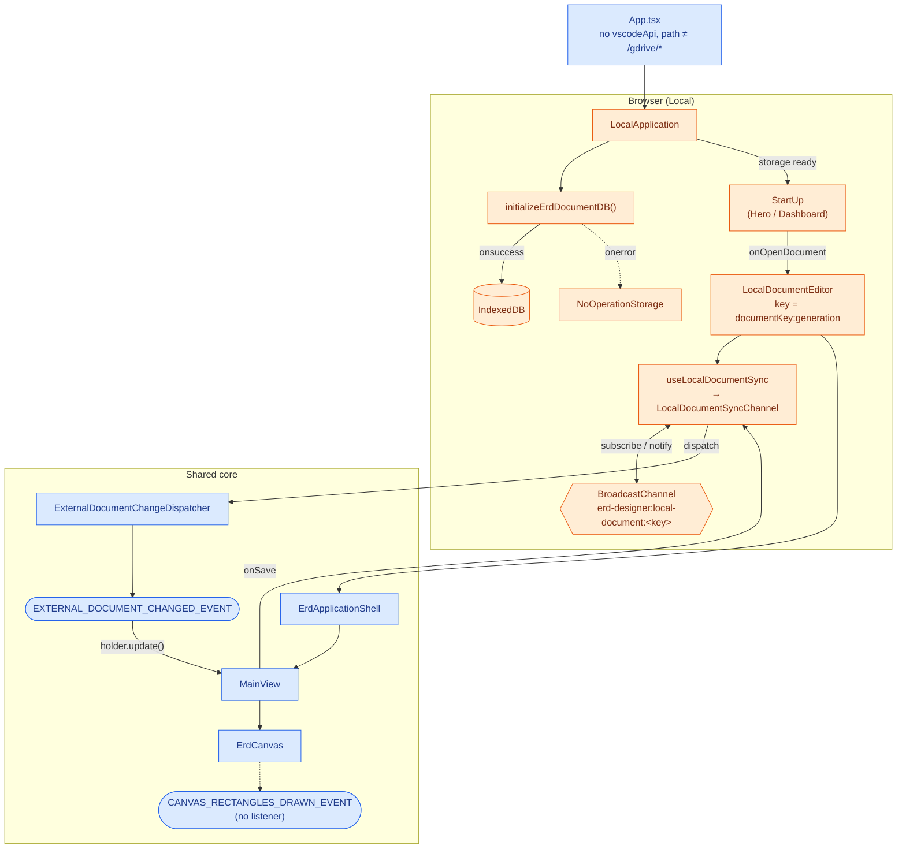
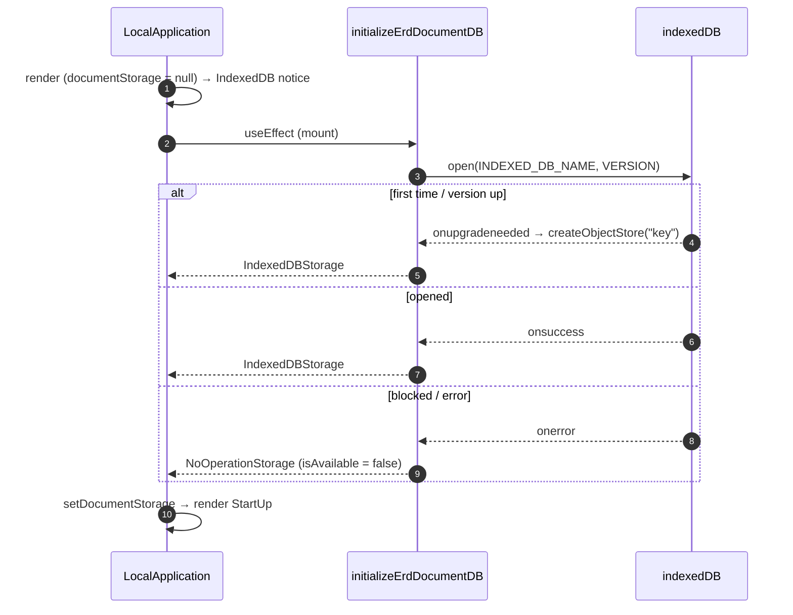
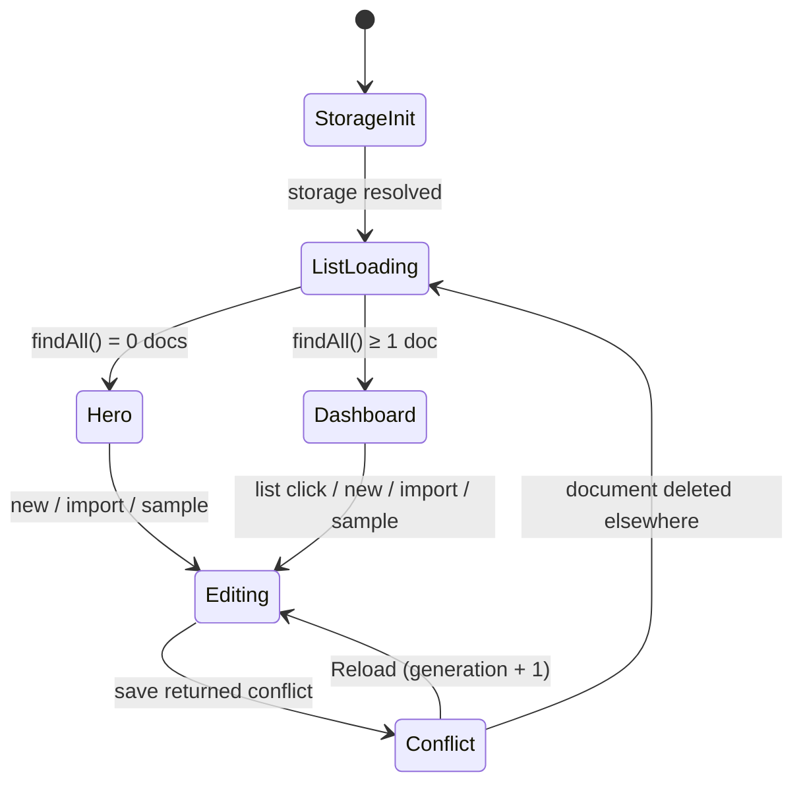
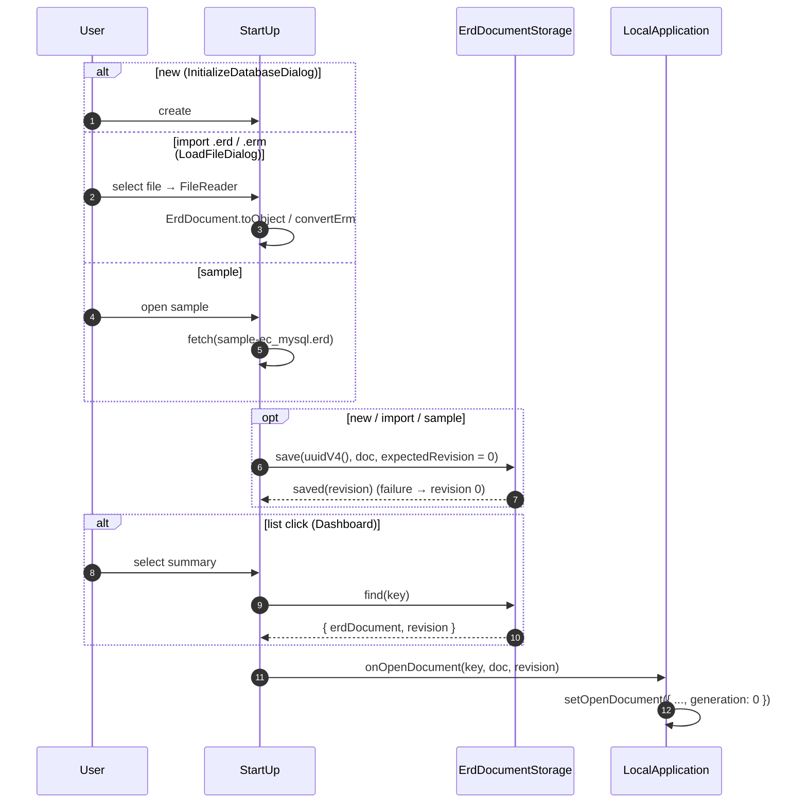
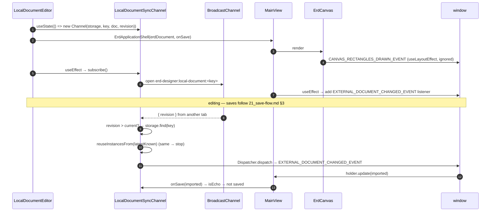
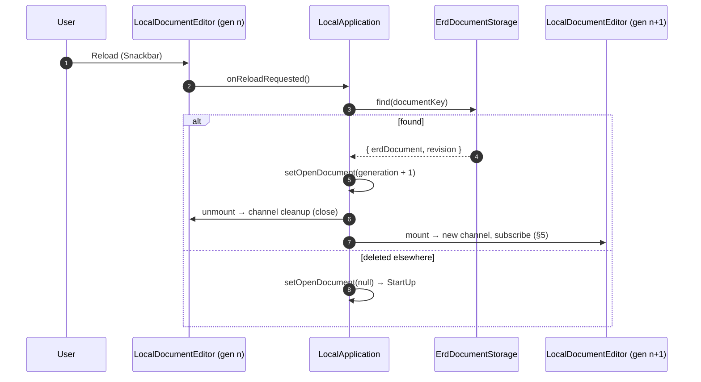

# Browser (Local) Startup Flow

## TL;DR

- **Selected by elimination.** `App.tsx` routes here when there is no `window.vscodeApi` and the path is outside
  `/erd-designer/gdrive/*`.
- **Storage first, then UI.** `LocalApplication` opens IndexedDB before it shows anything. If opening fails,
  `NoOperationStorage` is used instead: editing still works, but nothing is saved.
- **Every document is persisted before the editor opens.** New, imported and sample documents are saved with
  `expectedRevision = 0` under a fresh UUID. The editor starts from the revision that save actually assigned.
- **One editor = one sync channel.** `LocalDocumentEditor` is keyed by `documentKey:generation`. Its channel
  subscribes to BroadcastChannel in a `useEffect` setup/cleanup pair, so StrictMode and remounts never leave two
  channels alive.
- **Only one CustomEvent is used.** `EXTERNAL_DOCUMENT_CHANGED_EVENT` carries another tab's save into `MainView`.
  `CANVAS_RECTANGLES_DRAWN_EVENT` fires but has no listener in this build.
- **Reload after a conflict is a remount.** The editor re-reads the document and increments `generation`, which
  rebuilds the editor and its channel.

| Phase | Trigger | Main result |
|---|---|---|
| Storage init | `LocalApplication` mount | `IndexedDBStorage` or `NoOperationStorage` |
| Document list | `StartUp` mount | `findAll()` → Hero (0 docs) / Dashboard |
| Open | new / import / sample / list click | `onOpenDocument(key, doc, revision)` |
| Editor mount | `openDocument` set | channel subscribed, `MainView` built |
| Other-tab sync | BroadcastChannel message | `EXTERNAL_DOCUMENT_CHANGED_EVENT` → history |
| Reload | conflict → Reload | `generation + 1` → editor rebuilt |

Legend for the diagrams: **blue = shared by all builds**, **orange = Browser-specific**, stadium shape = CustomEvent.

---

## 1. Overview

Files: `src/App.tsx`, `src/features/LocalApplication.tsx`

---

## 2. Storage initialisation

**Key points:**
- `initializeErdDocumentDB()` always resolves. It never rejects, so the app always reaches `StartUp`.
- While the promise is pending, the "Please allow IndexedDB" notice is rendered. It flashes briefly even on a
  normal start.

Files: `src/features/storage/IndexedErdDocumentStorage.ts`, `src/features/storage/ErdDocumentStorage.ts`

---

## 3. Screen states

| State | Rendered by | Screen |
|---|---|---|
| StorageInit | `LocalApplication` | IndexedDB notice |
| ListLoading | `StartUp` | `CircularProgress` |
| Hero | `HeroLayout` | first-run landing |
| Dashboard | `DashboardLayout` | document list + actions |
| Editing | `LocalDocumentEditor` | `ErdApplicationShell` |
| Conflict | `LocalDocumentEditor` | editor + Reload Snackbar |

---

## 4. Opening a document

**Key points:**
- All four paths end in the same call, `onOpenDocument(documentKey, erdDocument, revision)`.
- New, import and sample documents are written before opening. Waiting for the assigned revision avoids a false
  conflict on the first edit.

Files: `src/features/start_up/StartUp.tsx`, `src/features/start_up/ErdDocumentListPanel.tsx`,
`src/features/start_up/InitializeDatabaseDialog.tsx`

---

## 5. Editor mount and the CustomEvent flow

**Key points:**
- Creating the channel has no side effects. Only `subscribe()` opens the BroadcastChannel, and the returned
  cleanup closes it.
- `onSave` comes from `useCallback`, so `MainView` does not rebuild its holder on every render.
- The Dispatcher lives inside the channel, one per editor. That is what makes the echo check reliable.

| Event | Fired by | Listened by | Effect in this build |
|---|---|---|---|
| `EXTERNAL_DOCUMENT_CHANGED_EVENT` | `LocalDocumentSyncChannel` (via Dispatcher) | `MainView` | other tab's save enters the undo history |
| `CANVAS_RECTANGLES_DRAWN_EVENT` | `ErdCanvas` | none | no effect |

Files: `src/features/storage/useLocalDocumentSync.ts`, `src/features/storage/LocalDocumentSyncChannel.ts`,
`src/features/MainView.tsx`

---

## 6. Reload after a conflict

Files: `src/features/LocalApplication.tsx`
