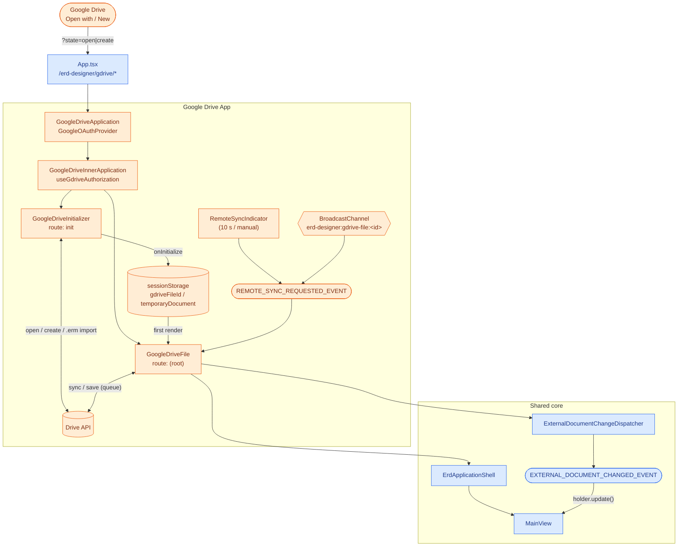
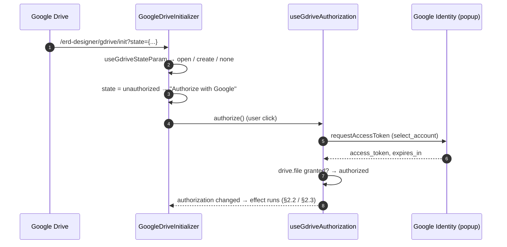
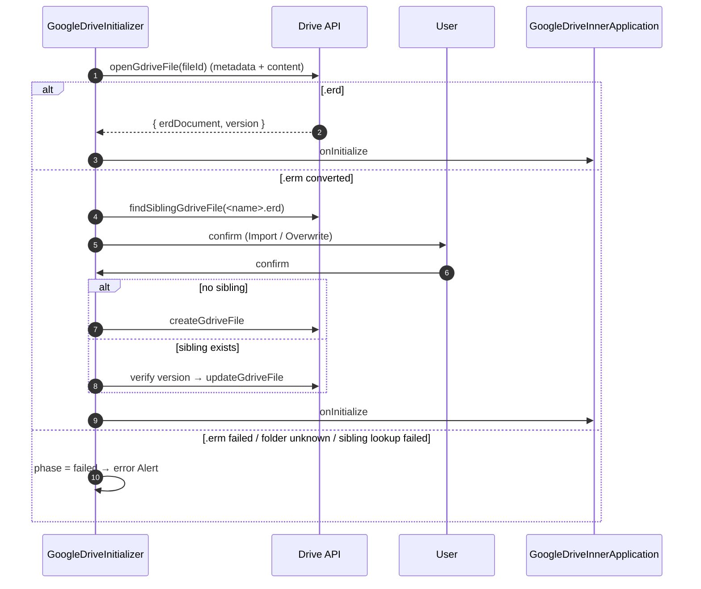
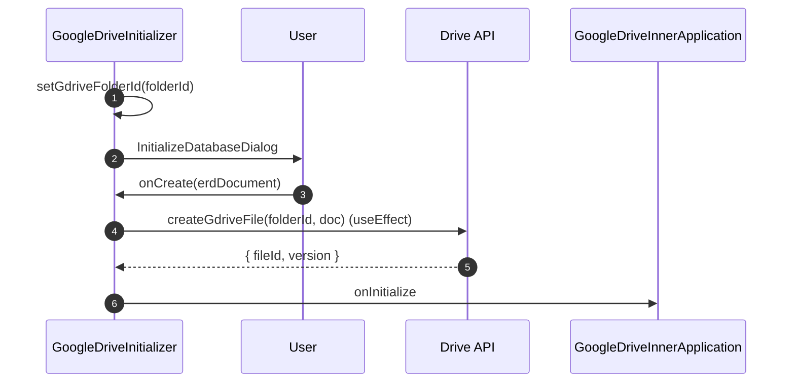
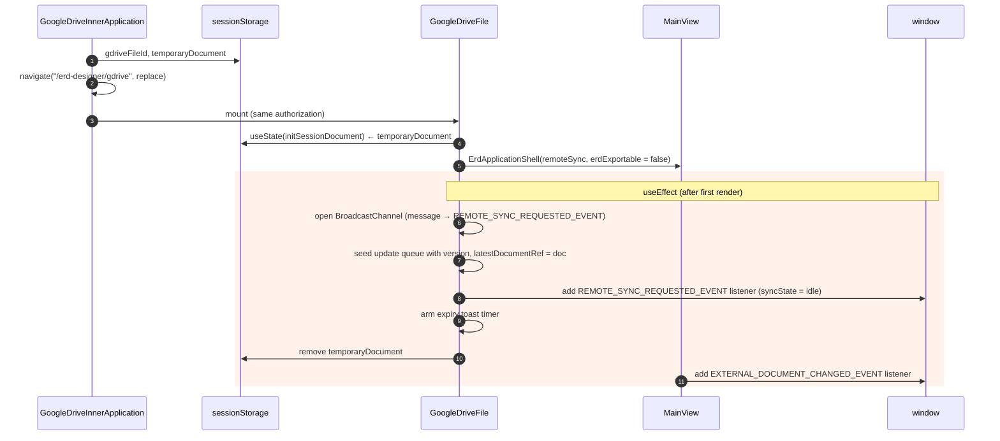
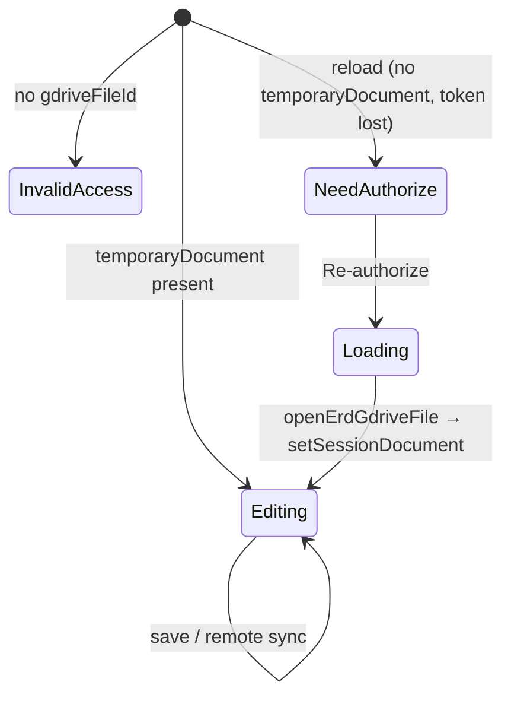
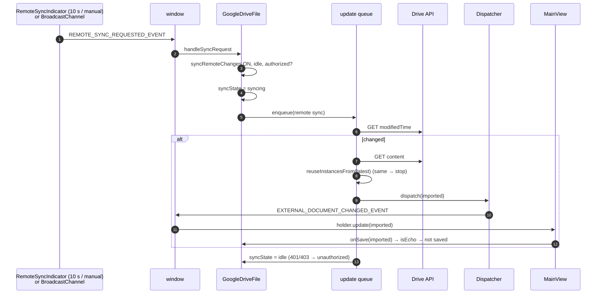
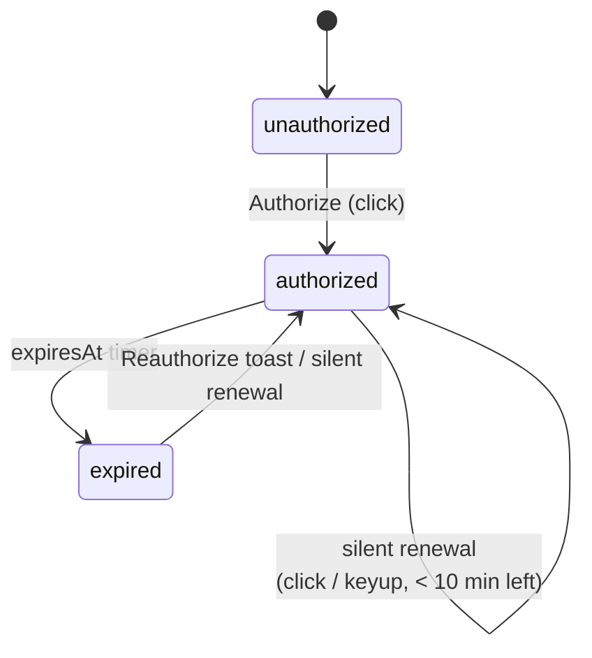

# Google Drive App Startup Flow

## TL;DR

- **Google Drive is always the entry point.** Drive's "Open with" and "New" redirect to
  `/erd-designer/gdrive/init?state=<json>`. `state` says `open` (file id) or `create` (folder id).
- **Two routes, one token.** `/init` (`GoogleDriveInitializer`) prepares the file. `/gdrive`
  (`GoogleDriveFile`) edits it. `useGdriveAuthorization` lives in their common parent, so the token survives the
  route change.
- **Authorization needs a click.** Google's token popup requires a user gesture, so the first screen is always
  "Authorize with Google".
- **The handoff goes through `sessionStorage`.** `/init` stores `gdriveFileId` and
  `temporaryDocument { erdDocument, version }`. `/gdrive` reads them in its first render and then deletes
  `temporaryDocument`.
- **A page reload starts from Drive, not from the cache.** The token lives only in memory and
  `temporaryDocument` is already gone. The user re-authorizes and the latest file is fetched again.
- **Remote sync is driven by one CustomEvent.** `REMOTE_SYNC_REQUESTED_EVENT` is fired by the 10 s timer, the
  refresh button and other tabs. It leads to `EXTERNAL_DOCUMENT_CHANGED_EVENT` only when `syncRemoteChanges` is ON.

| Phase | Route | Trigger | Main result |
|---|---|---|---|
| Authorize | `/init` | user clicks Authorize | token (`drive.file`, `drive.install`) |
| Prepare file | `/init` | `state.action` | `open`: fetch / `.erm` convert, `create`: new file |
| Handoff | `/init` → `/gdrive` | `onInitialize` | `sessionStorage` written, `navigate(replace)` |
| Editor mount | `/gdrive` | first render | `ErdApplicationShell`, effects registered |
| Remote sync | `/gdrive` | `REMOTE_SYNC_REQUESTED_EVENT` | changed file → history |
| Reload recovery | `/gdrive` | browser reload | re-authorize → `openErdGdriveFile` |

Legend for the diagrams: **blue = shared by all builds**, **orange = Google Drive-specific**, stadium shape = CustomEvent.

---

## 1. Overview

Files: `src/App.tsx`, `src/features/GoogleDriveApplication.tsx`

---

## 2. `/init`: authorize and prepare the file

### 2.1 Authorization

**Key points:**
- `state` is parsed once per query string (`useMemo`). A missing or invalid `action` becomes `none`, and nothing
  starts.
- The token expiry is shortened by 60 s (`expiresAt = expires_in − 60 s`), so the app never uses a token at the
  moment it expires.

### 2.2 `action = open`

### 2.3 `action = create`

Files: `src/features/gdrive/GoogleDriveInitializer.tsx`, `src/features/gdrive/gdrive-authorization.ts`,
`src/features/gdrive/gdrive-file-support.ts`

---

## 3. Handoff and editor mount

**Key points:**
- `onInitialize` writes `sessionStorage` and navigates with `replace: true`, so Back does not return to `/init`.
- `GoogleDriveFile` reads `temporaryDocument` in the `useState` initialiser. That is before any effect removes it.
- Every effect is registered at mount, but each waits for `sessionDocument`, `gdriveFileId` and an authorized
  token as needed.

### 3.1 Screen states

| State | Condition | Screen |
|---|---|---|
| InvalidAccess | `gdriveFileId == null` | "Invalid access" |
| NeedAuthorize | `sessionDocument == null`, not authorized | Re-authorize button |
| Loading | `sessionDocument == null`, authorized | `CircularProgress` |
| Editing | `sessionDocument` set | `ErdApplicationShell` + toast |

Files: `src/features/GoogleDriveApplication.tsx`, `src/features/gdrive/GoogleDriveFile.tsx`

---

## 4. Remote sync: the CustomEvent flow

**Key points:**
- `REMOTE_SYNC_REQUESTED_EVENT` is the only trigger for pulling remote changes. The timer, the manual button and
  other tabs all fire it, so there is only one import path.
- The request is ignored unless all three hold: `syncRemoteChanges` is ON (default OFF), `syncState` is `idle`,
  and the token is authorized.
- The sync task runs in the same queue as saves, so a pull never interleaves with a write.

| Event | Fired by | Listened by | Condition |
|---|---|---|---|
| `REMOTE_SYNC_REQUESTED_EVENT` | `RemoteSyncIndicator` timer (paused while hidden), refresh button, BroadcastChannel | `GoogleDriveFile` | sync ON, `idle`, authorized |
| `EXTERNAL_DOCUMENT_CHANGED_EVENT` | Dispatcher (in the sync task) | `MainView` | content changed |
| `CANVAS_RECTANGLES_DRAWN_EVENT` | `ErdCanvas` | none | no effect in this build |

The save half (queue, Web Locks, conflicts) is in [21_save-flow.md §4](./21_save-flow.md#4-google-drive-app).

Files: `src/features/gdrive/GoogleDriveFile.tsx`, `src/features/canvas/TitlePanel.tsx`,
`src/components/constant.ts`

---

## 5. Token lifecycle after startup

**Key points:**
- Google's popup cannot open from a timer. Renewal piggybacks on the first click or keyup once less than 10 min
  remain. Keys typed into text inputs are skipped.
- An expired token does not stop editing. Saves are held back (latest only) and written after re-authorization.

Files: `src/features/gdrive/gdrive-authorization.ts`, `src/features/gdrive/GoogleDriveFile.tsx`
