# VSCode Extension Startup and Display Flow

## TL;DR

- **Two startup phases.** VSCode activates the extension once per window (`onStartupFinished`). Each `.erd` file
  opened afterwards starts one webview panel.
- **Activation prepares shared state only.** `activate()` registers two custom editors and a configuration
  watcher, and starts the MCP server when `erdDesigner.mcpServer.enabled` is on. No document is read at this stage.
- **The webview asks for content.** The host cannot know when React is ready, so the webview posts `ready`. The
  host then reads the `TextDocument` and replies with `init`. Changes made between opening and `ready` are
  therefore never lost.
- **`ready` is also the registration point.** On `ready` the host registers the panel with
  `VsCodeDocumentResource`. Only after that can MCP tools see the document.
- **After `init`, the React tree talks to the host only through two window CustomEvents.**
  - `CANVAS_RECTANGLES_DRAWN_EVENT` carries table rectangles measured from the DOM, in the direction
    canvas → `drawnRectangles` → host. MCP tools use them to place tables.
  - `EXTERNAL_DOCUMENT_CHANGED_EVENT` carries a document into the undo history, in the direction
    `changeDocument` → `MainView` → `holder.update()`.
- **The first `drawnRectangles` is dropped.** The canvas fires its event in a layout effect, while the listener
  that is still attached captured `documentUri = ""`. The host receives rectangles only from the next redraw on.
- **Closing a panel undoes only that panel.** Watchers are disposed and its handler is unregistered. The document
  leaves `VsCodeDocumentResource` only when its last panel closes.

| Phase | Trigger | Runs in | Main result |
|---|---|---|---|
| Activation | `onStartupFinished` | extension host | editors registered, MCP server started |
| Panel resolve | `.erd` opened | extension host | watchers set, webview HTML injected |
| Webview boot | HTML loaded | webview | `window.vscodeApi` set, `ready` posted |
| Document init | `ready` received | host → webview | panel registered, `init` sent, first screen shown |
| Canvas display | `init` applied / redraw | webview | `CANVAS_RECTANGLES_DRAWN_EVENT` fired |
| Rectangle sync | the event above | webview → host | `drawnRectangles` stored for MCP tools |
| External change | `changeDocument` received | host → webview | `EXTERNAL_DOCUMENT_CHANGED_EVENT` → history |
| Teardown | panel closed / `deactivate` | extension host | watchers disposed, MCP server stopped |

Legend for the diagrams: **blue = shared by all builds**, **orange = VSCode-specific**, stadium shape = CustomEvent.

---

## 1. Overview

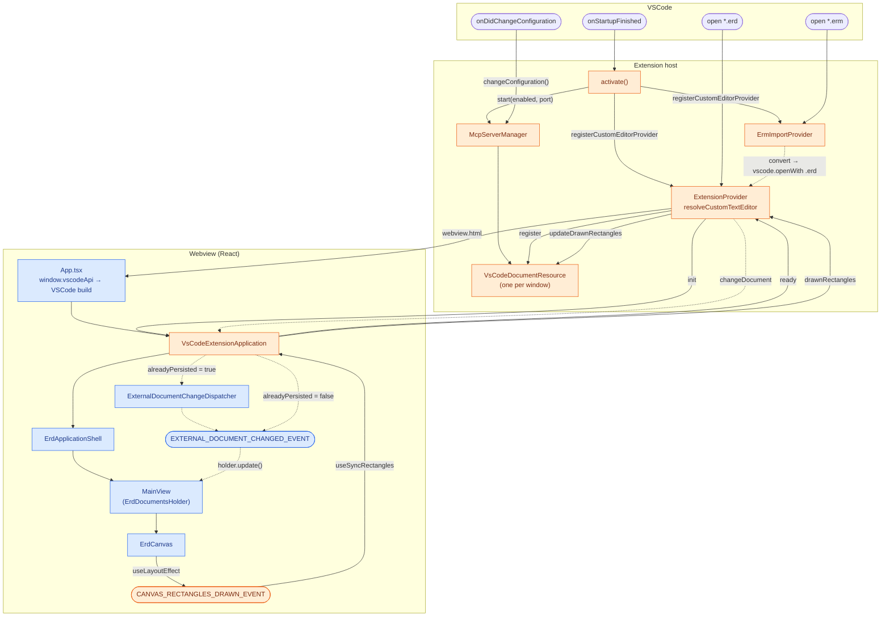

Files: `package.json` (`activationEvents`, `contributes`), `src/extension/extension.ts`, `src/App.tsx`

---

## 2. Activation

**Key points:**
- `VsCodeDocumentResource` and `McpServerManager` are module-level singletons, created when the bundle loads,
  before `activate()` runs. All panels and the MCP server share them.
- The `.erd` editor uses `retainContextWhenHidden: true`, so switching tabs does not restart the webview.
- MCP server start, stop and restart go through one Promise queue (`withLock`), so rapid setting changes apply in
  order.

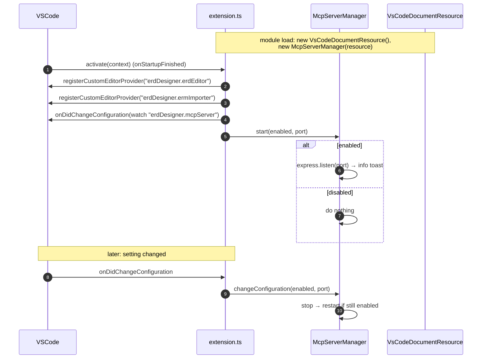

| Setting | Default | Effect |
|---|---|---|
| `erdDesigner.mcpServer.enabled` | `false` | start / stop the MCP server |
| `erdDesigner.mcpServer.port` | `53753` | port of `http://localhost:<port>/mcp` |

Files: `src/extension/extension.ts`, `src/extension/McpServerManager.ts`

---

## 3. Opening a `.erd` file

### 3.1 Panel resolve (extension host)

`resolveCustomTextEditor` only wires the panel. It does not read the document.

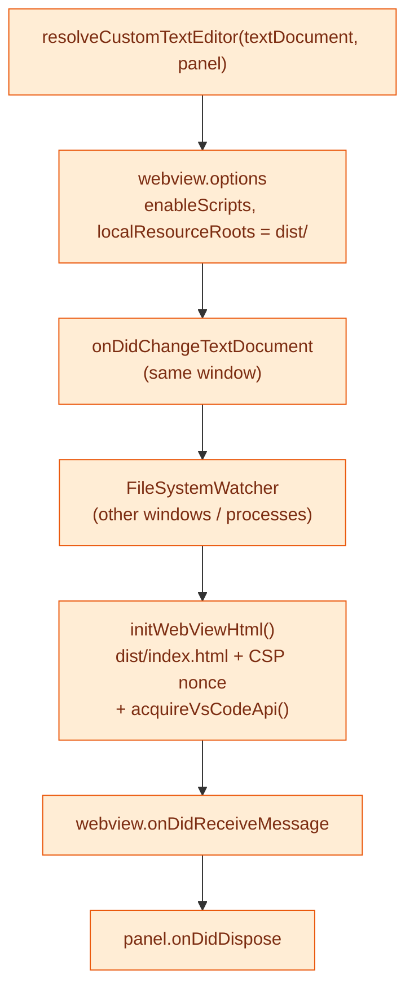

- `initWebViewHtml()` removes the original `<script>`/`<link>` tags, re-adds them as `asWebviewUri` URLs, and
  injects `window.vscodeApi = acquireVsCodeApi()`. That global is what makes `App.tsx` pick the VSCode build.
- `onDidReceiveMessage` is registered after `html` is set. Messages cannot arrive before the script runs, so this
  order is safe.

### 3.2 Handshake (`ready` → `init`)

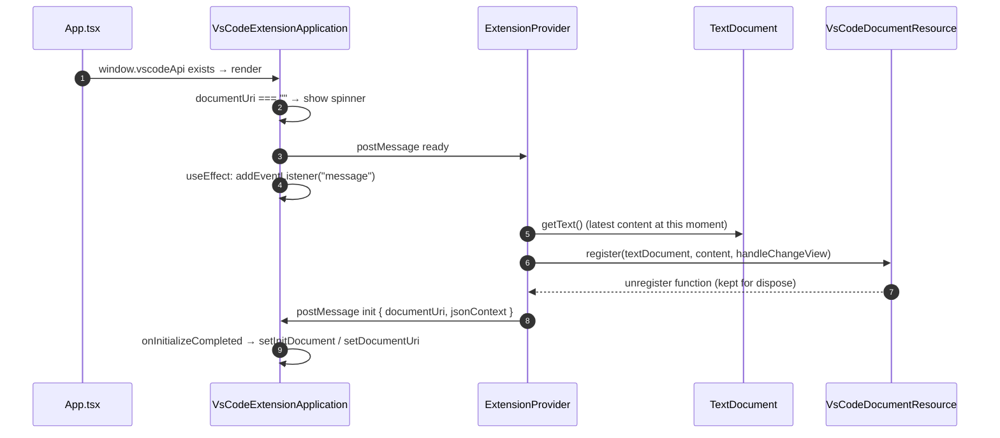

- The `init` reply is asynchronous, so the `message` listener is attached before it arrives.
- `ready` is posted from render while `documentUri === ""`. It can be sent more than once (for example the
  StrictMode double render), and each one repeats register and `init`.
- `register()` for a URI that another panel already holds only adds this panel's handler. The existing document
  state is kept.

### 3.3 First screen

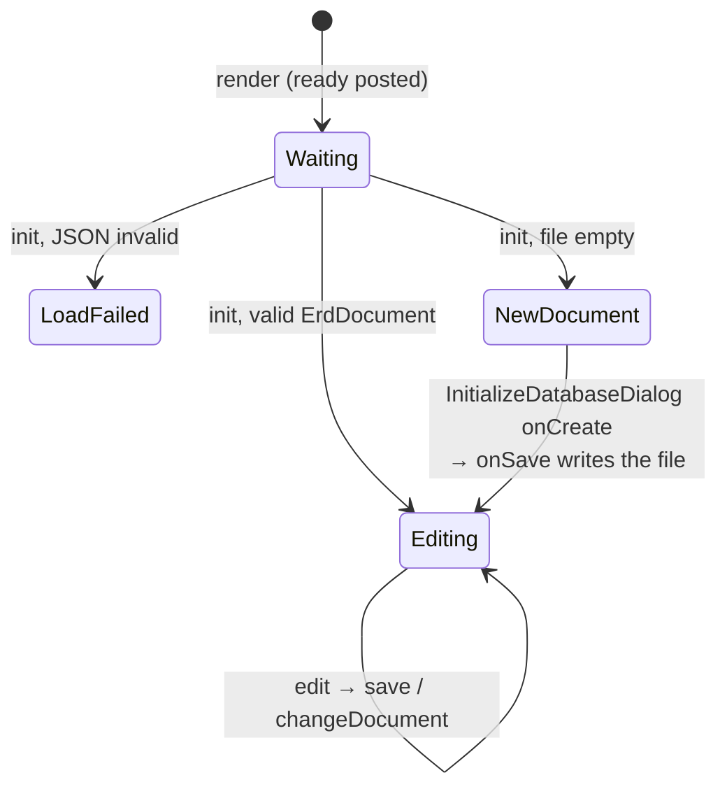

| State | Condition | Screen |
|---|---|---|
| Waiting | `documentUri === ""` | `CircularProgress` |
| LoadFailed | `loadResult === "failure"` | "Failed to load erd file." |
| NewDocument | `initDocument === null` | `InitializeDatabaseDialog` |
| Editing | `initDocument` set | `ErdApplicationShell` (`erdExportable = false`) |

Files: `src/extension/ExtensionProvider.ts`, `src/extension/vscode-message-resolver.ts`,
`src/features/VsCodeExtensionApplication.tsx`, `src/extension/VsCodeDocumentResource.ts`

---

## 4. Displaying the `.erd`: CustomEvent flow

**Key points:**
- `postMessage` stops at `VsCodeExtensionApplication`. Components below it (`MainView`, `ErdCanvas`) never touch
  `vscodeApi`. They exchange data with it only through window CustomEvents, so the shared core stays free of the
  VSCode build.
- The rectangles come from the DOM, not from the model. Only the canvas knows them, and only after layout.
- Each listener captures its dependencies in a closure (`documentUri`, `documentsHolder`) and is swapped in a
  **passive** effect (`useEffect`). The canvas fires in a **layout** effect, which runs earlier in the same commit.

### 4.1 Events

| Event | Fired by | Fired in | Listened by | Listener registered in | `detail` |
|---|---|---|---|---|---|
| `CANVAS_RECTANGLES_DRAWN_EVENT` | `ErdCanvas` | `useLayoutEffect` after measuring the DOM | `useSyncRectangles` (`VsCodeExtensionApplication`) | `useEffect`, deps `documentUri`, `vscodeApi` | `tableRectangles: Map<tableId, RectangleViewModel>` |
| `EXTERNAL_DOCUMENT_CHANGED_EVENT` | `ExternalDocumentChangeDispatcher` / `onExternalChangedDocument` | message handler (synchronous) | `MainView` | `useEffect`, deps `documentsHolder` | `erdDocument: ErdDocument` |

Both constants live in `src/components/constant.ts`. `CANVAS_RECTANGLES_DRAWN_EVENT` has a listener only in the
VSCode build. In the other builds it fires and nothing receives it.

### 4.2 From `init` to the first paint

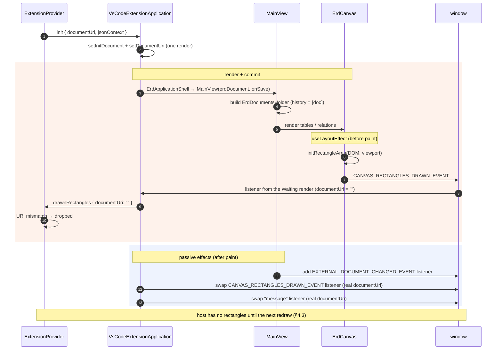

- The table is on screen after step 1, but MCP tools see `rectangles` as empty until a redraw.
- With 0 tables the event is skipped, so a new document sends nothing either.

### 4.3 Redraw → rectangle sync

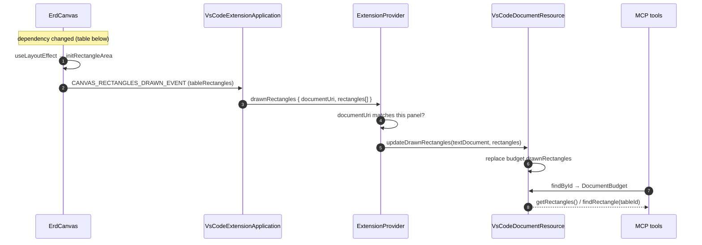

| Re-fire trigger (effect dependency) | Typical cause |
|---|---|
| `erdDocument.lastUpdatedAt` | any edit, undo/redo, applied external change |
| `scaleState.scale` | zoom |
| `dragState.status` | drag start / end |
| `currentPerspective` | perspective switch |
| `viewport` | canvas remount |

`drawnRectangles` is not a save. It only updates the host's in-memory `DocumentBudget`.

### 4.4 `changeDocument` → `EXTERNAL_DOCUMENT_CHANGED_EVENT`

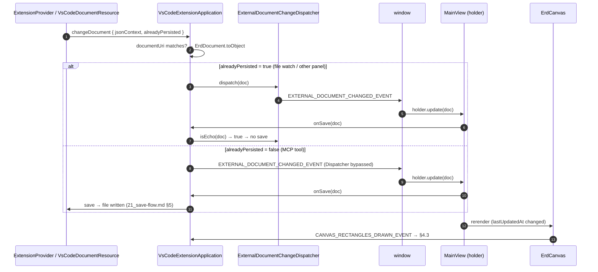

- `window.dispatchEvent` is synchronous, so `isEcho()` is evaluated while `D` still holds `doc`.
- An external change also updates the rectangles on the host, because it changes `lastUpdatedAt`.

### 4.5 Listener lifetimes

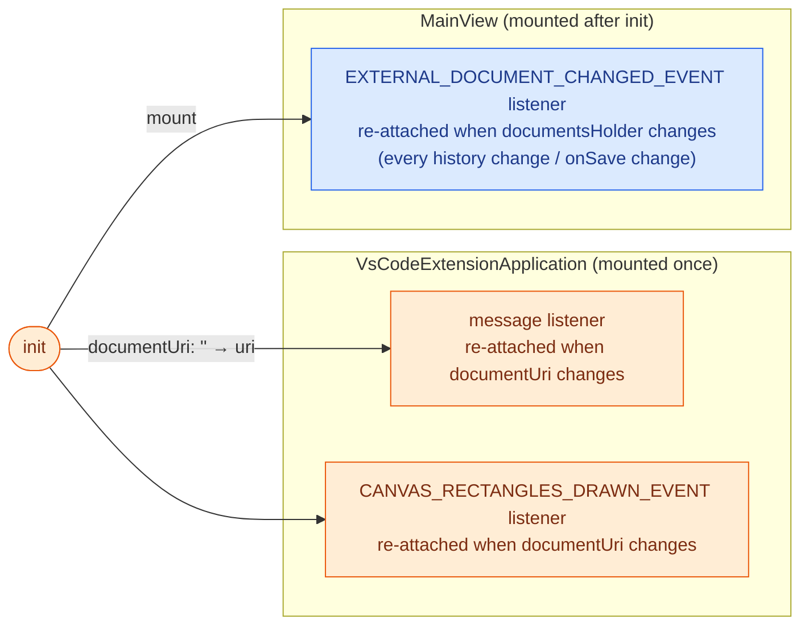

- The `message` and rectangle listeners change exactly once, at `init`. §4.2 is the only window where a stale
  closure is observable.
- `MainView` re-attaches its listener on every history change. It does not fire `CANVAS_RECTANGLES_DRAWN_EVENT`
  itself, so the stale-closure case in §4.2 does not apply to it.

Files: `src/features/VsCodeExtensionApplication.tsx`, `src/features/MainView.tsx`,
`src/features/canvas/ErdCanvas/ErdCanvas.tsx`, `src/components/ExternalDocumentChangeDispatcher.ts`,
`src/components/constant.ts`, `src/extension/vscode-message-resolver.ts`, `src/agent-tools/DocumentBudget.ts`

---

## 5. Other entry points

### 5.1 Opening a `.erm` file

`ErmImportProvider` has no editor of its own. It converts the file, writes a `.erd` next to it, and reopens that
`.erd` with the normal editor. From there §3 and §4 apply.

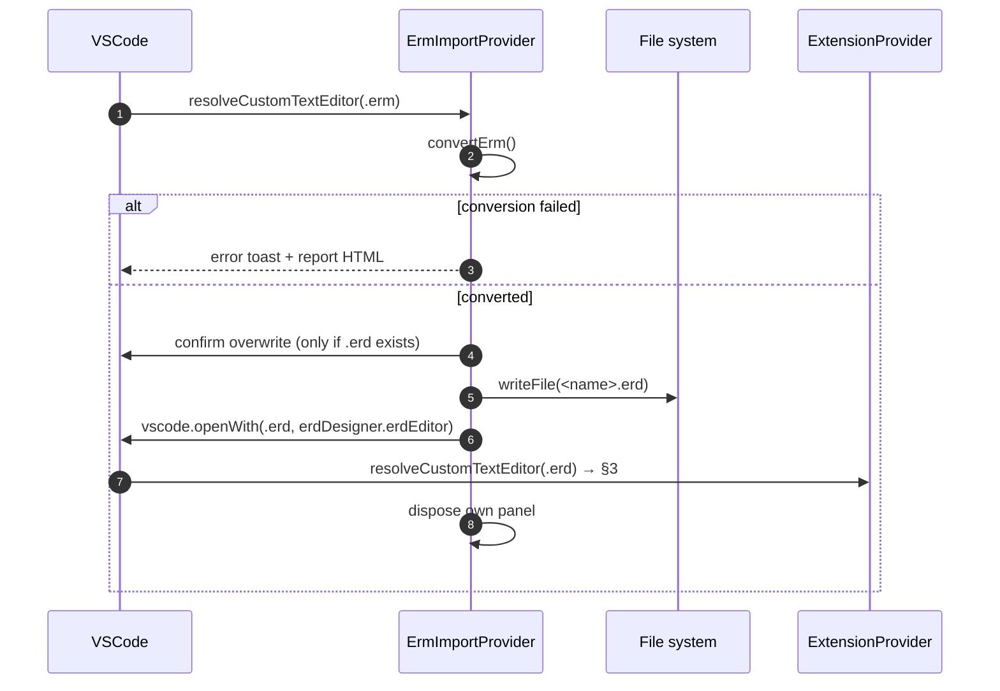

### 5.2 MCP tool `create`

The MCP tool writes a new file and opens it with the editor. It then polls until the `ready` registration
completes (every 100 ms, up to 3 s), because the document is invisible to tools before that.

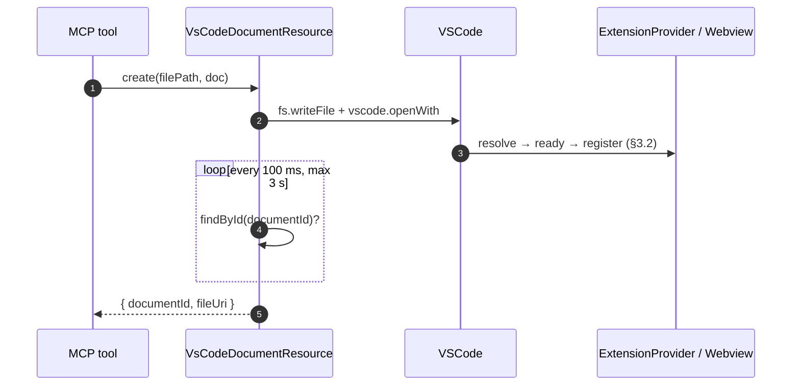

- On timeout the tool still returns. The `documentId` is derived from the URI, so later calls can find it.
- Rectangles for the new document follow §4.2: they are empty until the first redraw.

Files: `src/extension/ErmImportProvider.ts`, `src/extension/VsCodeDocumentResource.ts`

---

## 6. Teardown

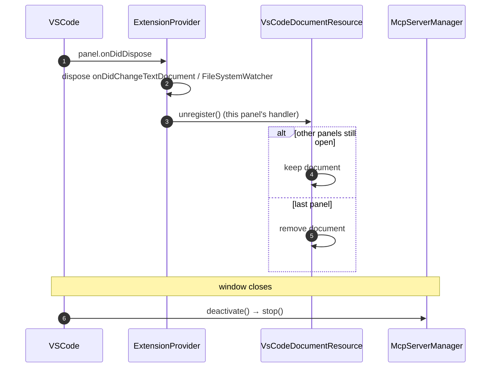

Files: `src/extension/ExtensionProvider.ts`, `src/extension/extension.ts`
