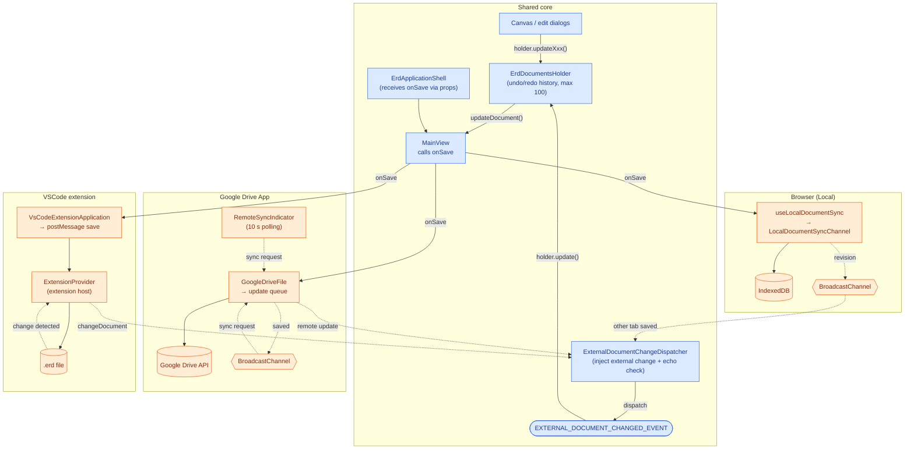
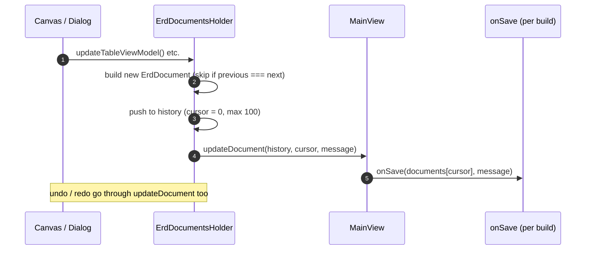
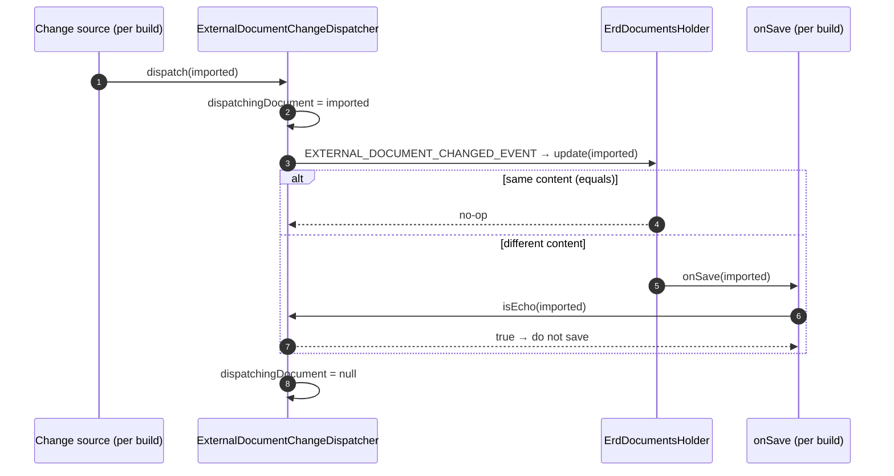
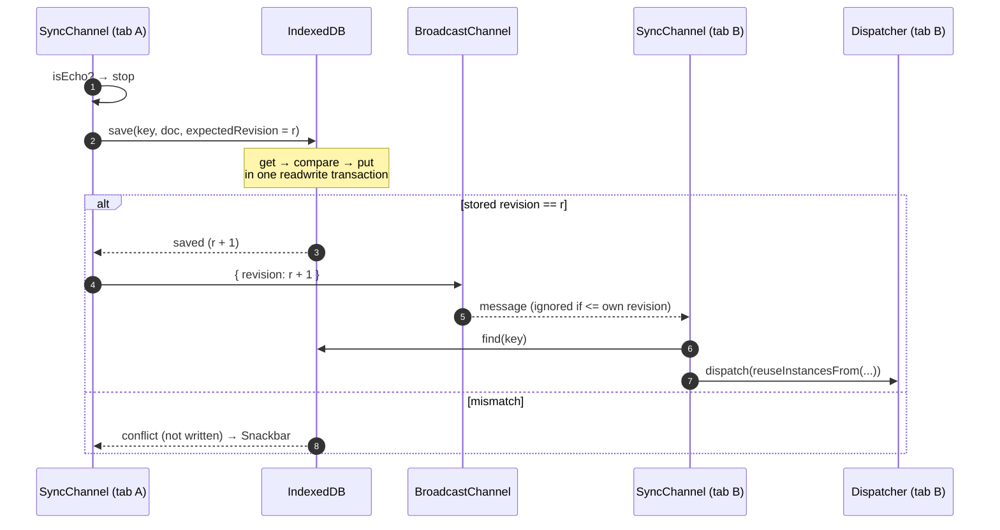
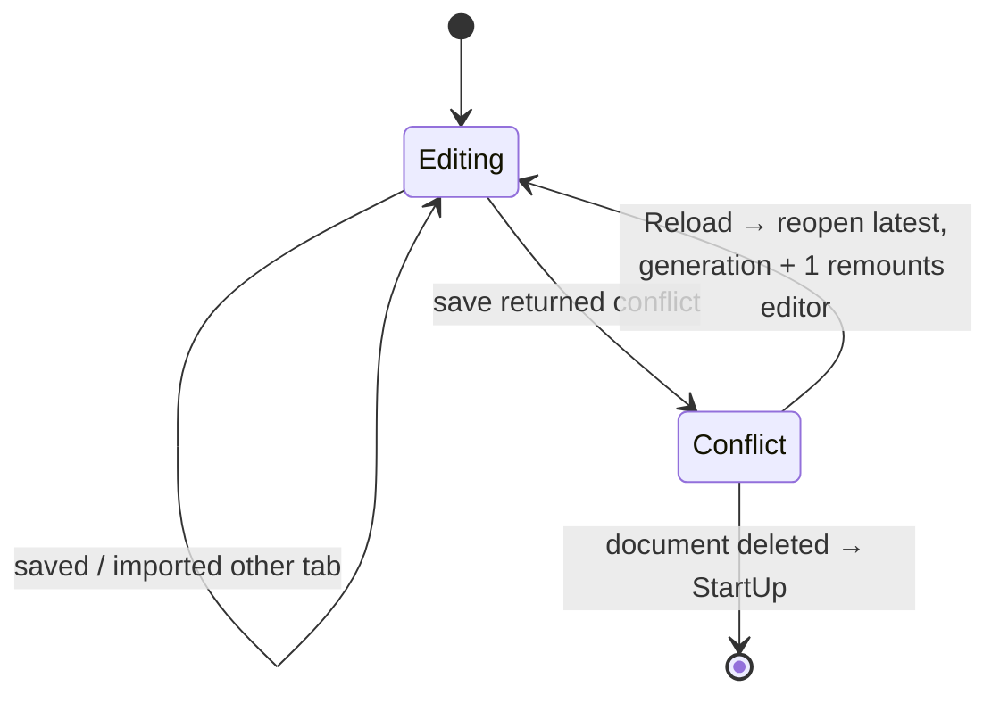
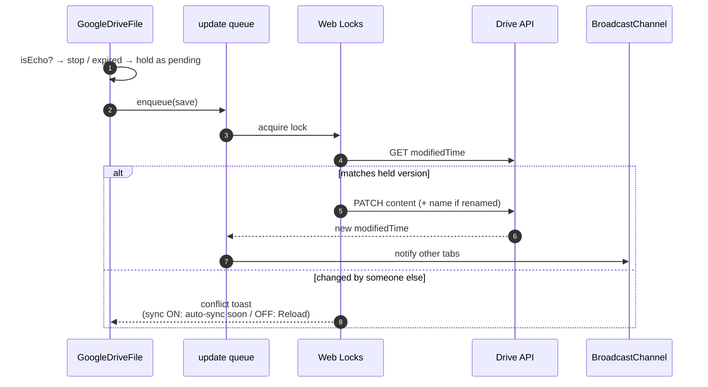
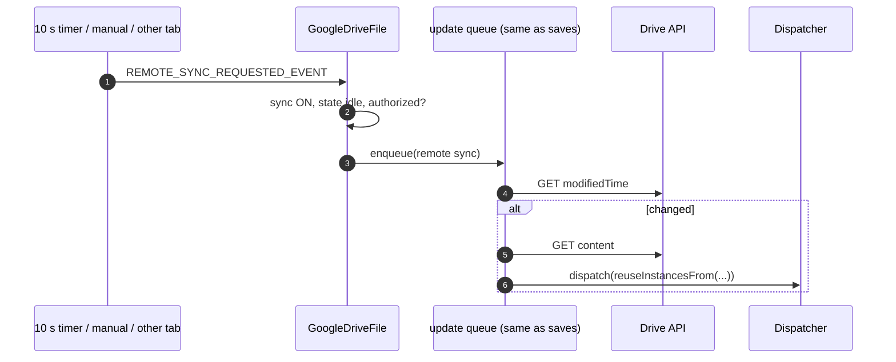
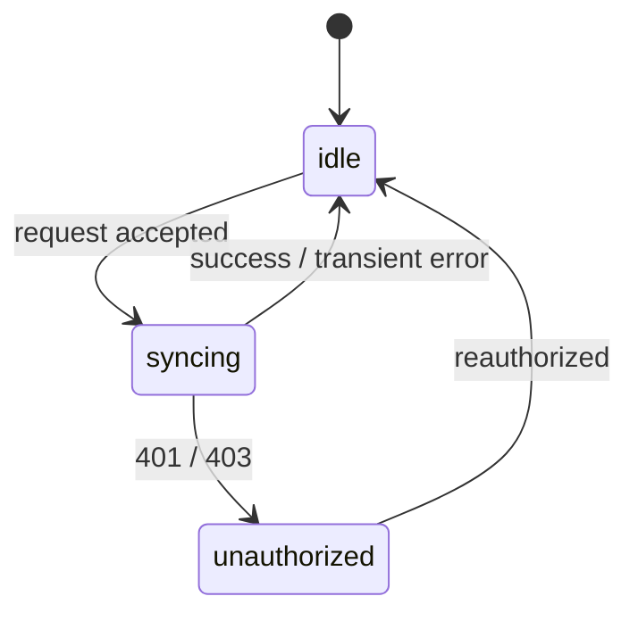
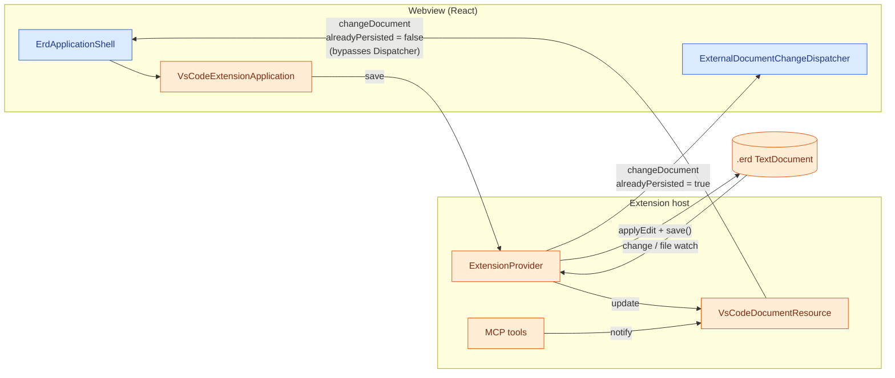
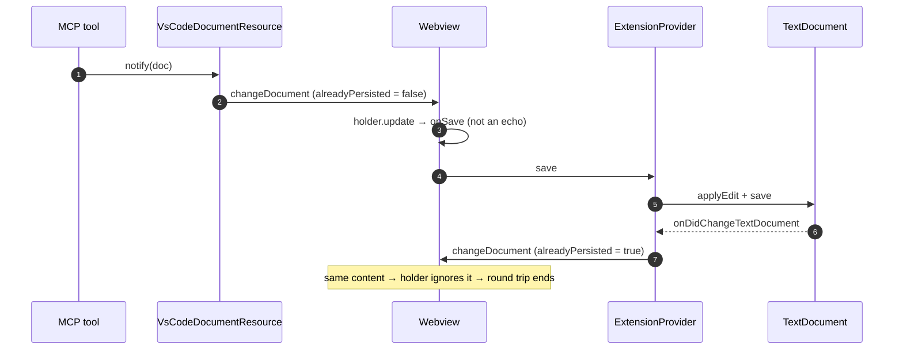

# Save Flow Architecture

## TL;DR

- **One editing core, three save backends.** The Browser (Local), Google Drive and VSCode builds share the editing
  core. Each build supplies only its own `onSave`, which decides where and how the document is written.
- **Saving is automatic.** Every edit, undo and redo goes through `ErdDocumentsHolder`, and `MainView` then calls
  `onSave`. There is no save button.
- **External changes take the same path.** A change made somewhere else is injected with
  `ExternalDocumentChangeDispatcher` and applied with `holder.update()`, so it also lands in the undo history.
- **Echoes are suppressed in one shared place.** Applying an external change calls `onSave` again with the same
  instance. `isEcho()` detects this by reference identity so the change is not written back.
- **Concurrency follows one pattern:** an optimistic version check, a notification to other windows, and a reload.
  Each build differs only in what the version is and where atomicity comes from.

| | Browser (Local) | Google Drive App | VSCode extension |
|---|---|---|---|
| Storage | IndexedDB | Drive API | `WorkspaceEdit` + `TextDocument.save()` |
| Version | `revision` (integer) | `modifiedTime` | none (delegated to VSCode) |
| Atomic check-and-write | one IndexedDB readwrite transaction | in-tab queue + Web Locks across tabs | VSCode |
| Detecting other windows | BroadcastChannel | BroadcastChannel + 10 s polling | `onDidChangeTextDocument` + FileSystemWatcher |
| On conflict | later save rejected → Reload | later save rejected → auto-sync or Reload | last write wins |

Legend for the diagrams: **blue = shared by all builds**, **orange = specific to one build**.

---

## 1. Overview

`src/App.tsx` selects the build: `window.vscodeApi` → VSCode, `/erd-designer/gdrive/*` → Google Drive, anything
else → Local.

---

## 2. Shared mechanisms

### 2.1 From edit to `onSave`

- `ErdDocument` is immutable. Unchanged sub-models share instances.
- `MainView` rebuilds `documentsHolder` whenever the `onSave` reference changes, so **every build must stabilise
  `onSave` with `useCallback`**.

Files: `src/context/ErdDocumentsHolderContext.ts`, `src/features/MainView.tsx`, `src/features/ErdApplicationShell.tsx`

### 2.2 External changes and echo suppression

`dispatch()` holds the imported instance only while it runs. `window.dispatchEvent` runs synchronously through
`holder.update()` into `onSave`. If `onSave` receives that same instance, the call is an echo.

Each build owns **exactly one** Dispatcher instance. If two stay alive, the echo check misses and saves loop.

### 2.3 Instance reuse on import

A document parsed from JSON has all-new instances, which would duplicate the undo history. Local and Google Drive
run `reuseInstancesFrom(current)` first. If nothing changed, it returns `current` itself, so `===` drops no-op
updates cheaply.

---

## 3. Browser (Local)

**Key points:** IndexedDB check-and-write keyed by `revision`, first write wins. Other tabs learn about a save
through BroadcastChannel and re-read the document from IndexedDB. If IndexedDB is unavailable,
`NoOperationStorage` lets editing continue without saving.

Files: `src/features/storage/*`, `src/features/LocalApplication.tsx`, `src/features/start_up/StartUp.tsx`

---

## 4. Google Drive App

**Key points:**
- The Drive API has no check-and-write operation. Exclusion is done on the client instead: a Promise-chain queue
  (`updateQueueRef`) within a tab, and `navigator.locks` across tabs.
- Before each write, the client compares the stored `modifiedTime` with the one it holds.
- Remote changes are pulled only through `REMOTE_SYNC_REQUESTED_EVENT`, which the 10 s timer, the manual refresh
  button and other tabs' broadcasts all fire. This happens only while `syncRemoteChanges` is ON.
- While authorization is expired, only the latest document is held back. It is saved after reauthorization, and
  the same version check still applies.

Files: `src/features/gdrive/GoogleDriveFile.tsx`, `src/features/gdrive/gdrive-file-support.ts`,
`src/features/gdrive/gdrive-authorization.ts`, `src/features/canvas/TitlePanel.tsx`

---

## 5. VSCode extension

**Key points:**
- The webview cannot write files, so it sends a `save` message to the extension host. The host then applies a
  `WorkspaceEdit` and calls `save()`.
- File changes arrive through `onDidChangeTextDocument` (same window) or the FileSystemWatcher (other windows).
  The host sends them to every panel with `alreadyPersisted = true`, so they are echo-suppressed.
- **MCP tool edits are the exception.** They exist only in memory, so they are sent with `alreadyPersisted = false`
  and **skip the Dispatcher**. The webview's normal `onSave` round trip is what writes them to disk.

| Message | Direction | Purpose |
|---|---|---|
| `ready` | webview → host | host registers the panel and replies with `init` |
| `init` | host → webview | file content (empty → new-document dialog) |
| `save` | webview → host | `ErdDocument.toJSON()` to write |
| `changeDocument` | host → webview | external change + `alreadyPersisted` |
| `drawnRectangles` | webview → host | table rectangles for MCP tools (not saving) |

Files: `src/features/VsCodeExtensionApplication.tsx`, `src/extension/ExtensionProvider.ts`,
`src/extension/vscode-message-resolver.ts`, `src/extension/VsCodeDocumentResource.ts`

---

## 6. Checklist for a new save backend

1. Implement `onSave(document, loggingMessage)`, stabilise it with `useCallback`, and pass it to
   `ErdApplicationShell`.
2. Keep exactly one `ExternalDocumentChangeDispatcher`. Inject changes with `dispatch()` and check `isEcho()`
   first in `onSave`.
3. Echo-suppress only changes that are already persisted. Suppressing an unpersisted change loses it.
4. Serialise asynchronous saves, and update the optimistic version from each save result.
